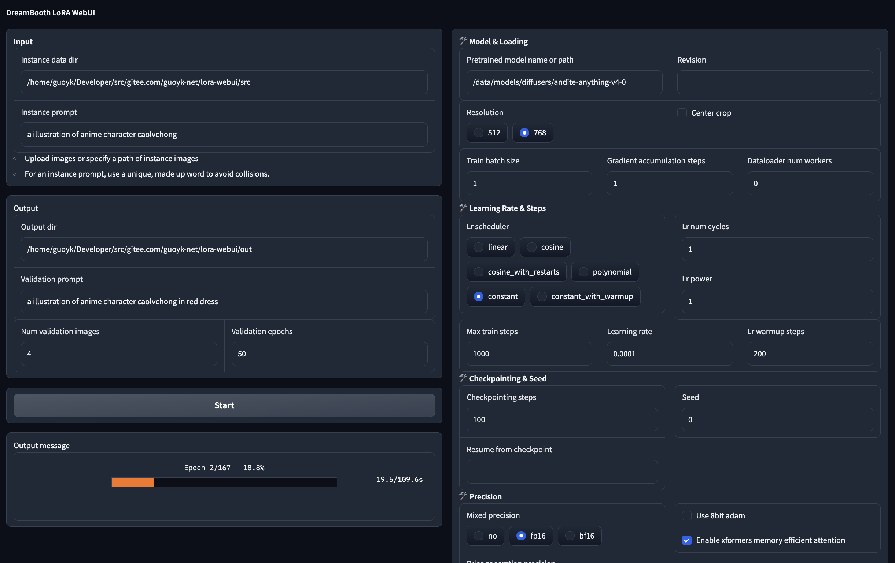

# lora-webui

Gradio WebUI for LoRA Training

## Screenshot



## Features

* Tuning parameters
* Showing Progress
* Automatically converting to `Stable Diffusion WebUI` compatible `.safetensors` file

## Installation

* Prepare `venv`

  ```shell
  python3 -m venv venv
  source venv/bin/activate
  pip install -r requirements.txt
  ```

* Start the app

  ```shell
  python app.py
  ```

## References

* https://github.com/huggingface/diffusers/blob/main/examples/dreambooth/train_dreambooth_lora.py
* https://github.com/harrywang/finetune-sd/blob/main/convert-to-safetensors.py

## Donation

View https://guoyk.xyz/donation

## Credits

Guo Y.K., MIT License
